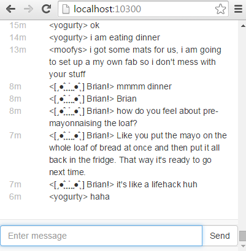

# nekocafe
A toy chat server

* connect with any websocket capable web browser
* ios/android support (sort of)
* url hotlinking
* web notifications

Usage:
```
C:\>node nekocafe.js <portnumber>
```


