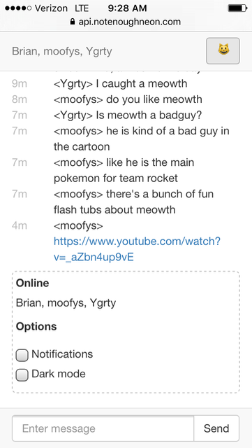

# nekocafe
Web chat room 🐱 💬

[](https://www.npmjs.com/package/nekocafe)




A chat server using websockets. Send your friends the url and chat through the browser.

* designed for mobile
* no passwords/registration
* 100 line backlog
* hotlinked urls
* embedded images, youtubes, tweets

## Installing

```
npm install -g nekocafe
```

## Running
```
nekocafe <portnumber>
```

For https mode, pass your certificates on the command line:
```
nekocafe <portnumber> <keyfile.pem> <certfile.pem>
```

## Development

`npm run dev` to build client side (outputs to dist/)

`node lib/server.js <portnumber>` to run the server (does not need to restart after client rebuild)

or `npm run start` to run on port 80

## Protocol

### Client

#### `nick, name: string`

Set nick of the connecting client. Required after connecting.

#### `replay`

Request server to replay all messages in the backlog. Not required.

#### `message, text: string`

Send a message to the chatroom.

#### `file, {name: string, type: string, data: blob}`

Send a file attachment. `type` is the mimetype which will be used to embed the media, if possible.

### Server

#### `users, Array<{id: string, nick: string}>`

The list of connected users. Sent after a client connects.

#### `join, {id: string, nick: string}`

Sent when a user joins.

#### `part, {id: string, nick: string}`

Sent when a user leaves.

#### `time, now: number`

Current server time, sent every 15 seconds. Used to provide accurate timestamp deltas despite clock drift between client/server.

#### `message, {time: number, nick: string, message: string, embeds: Array<{type: ('html'|'tweet'), html?: string, id?: string}>}`

A message sent to the chatroom. HTML is not stripped from the content. `embeds` contains a list of parsed embed content. 

## Changelog

* 1.3.0 - file uploads
* 1.2.0 - embedded youtubes, tweets
* 1.1.0 - embedded images, remember username/prefs, performance improvements
* 1.0.0 - first release
